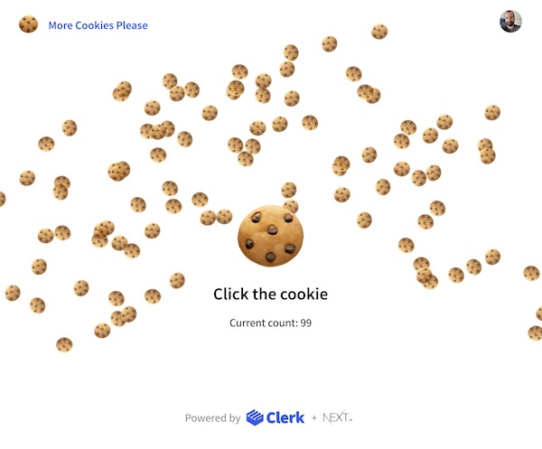

# More Cookies Please 🍪

  

This sample repo is associated with a [Clerk and Hasura tutorial](https://clerk.dev/tutorials/build-a-cookie-clicker-app-with-clerk-and-hasura) that demonstrates how you can use [Clerk](https://clerk.dev) to authenticate with a [Hasura](https://hasura.io/) GraphQL API endpoint.

You can browse the code and run it locally, but it will not connect to the GraphQL API and Postgres database without setting your own [environment variables](./env.local.sample) and running the [Docker services](./docker-compose.yml).

---

**Clerk is Hiring!**

Would you like to work on Open Source software and help maintain this repository? [Apply today](https://apply.workable.com/clerk-dev/)

---

## Cookie Clicker App

The application built as part of the [tutorial](https://clerk.dev/tutorials/build-a-cookie-clicker-app-with-clerk-and-hasura) is a Cookie Clicker app, where users can log in and click a big cookie button to be rewarded with more cookies. The click count is maintained in a scoreboard database.

## Contact

If you need support or have anything you would like to ask, please reach out on our [Discord channel](https://discord.com/invite/b5rXHjAg7A). We'd love to chat!
